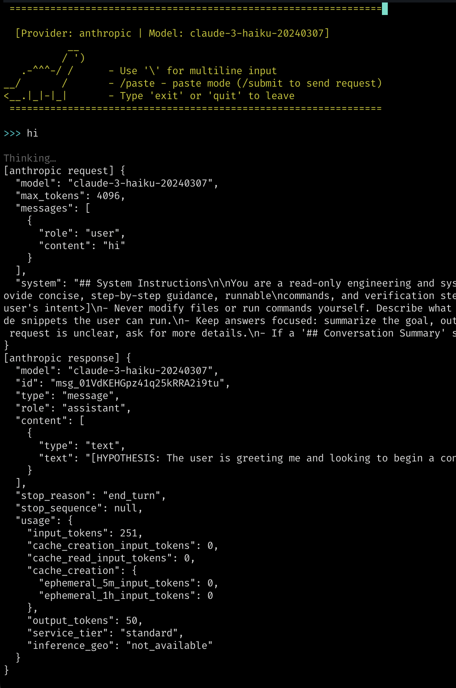
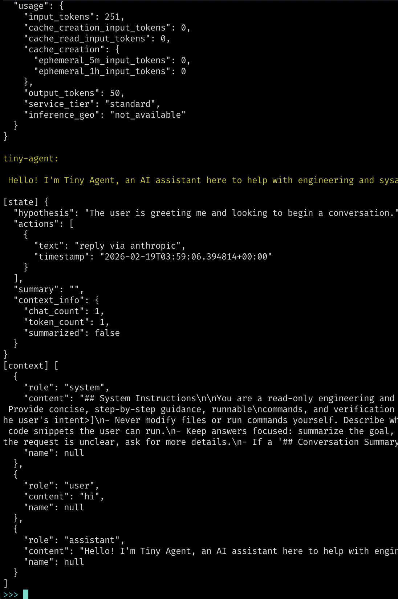

#  Tiny Agent 🦕

## A minimal CLI agent written in Python — a starting point to build your own agent.

This project is designed as a reference implementation you can study, fork, or extend
to fit your needs. Each branch introduces a single concept:

  | Branch | Concept |
  |--------|---------|
  | [`main`](../../tree/main) | Core agent: REPL, context slicing, auto-summarization |
  | > [`skills`](../../tree/skills) | `/skill` — inject reusable Markdown playbooks at runtime |
  | [`tools-skills`](../../tree/tools-skills) | Tool execution — read files, grep, run commands |


- Start with `main` to understand the basics, then checkout feature branches to explore more.
- Fork any branch as a starting point for your own project.
- Supports multiple providers (`anthropic`, `openai`).

## Skills Demo


## What It Does
- Acts as a **read-only** engineering helper: inspects problems, explains root causes, and shows you how to fix them manually

- Normalized context messages

- Maintains a rolling conversation context (20-turn window) with automatic summarization when the turn count or token usage (~20k) is exceeded, keeping the 5 most recent turns after each summarization

- Offers a basic REPL with multiline input (`\\`), paste mode with `/paste` and `/submit` to send the request

- `/skill` helper that lists skills under `~/.tinyagent/skills/` and loads
  `<skill>/SKILL.md` (trimmed to ~4 KB) directly into the conversation as a
  `## Skill:` block. It stays opt-in and can be disabled via `--disable-skills`.

## Project structure (Skills)
```
tiny_agent/
  cli.py            # REPL loop and argument parsing
  core/
    messages.py     # Role enum, Message normalization
    context.py      # Message history, context slicing, summarization
    skills.py       # Skill discovery and loading from ~/.tinyagent/skills/
    state.py        # Hypothesis, actions (with timestamps), context info, summary
    utils.py        # Shared helpers (colorize, token counting, env loading)
    ai_providers.py
      LocalProvider       # Offline heuristic provider (testing/prototyping)
      AnthropicProvider   # Anthropic Messages API
      OpenAIProvider      # OpenAI Chat Completions API
```

### How it works

The CLI reads user input, adds it to the **ContextManager** (which holds
the conversation history), checks if the history needs summarizing, then
calls the provider. The provider grabs a context slice, converts it to
the right API format, sends the request, and updates the **StateManager**
with any hypothesis or action from that turn. The reply goes back into
the ContextManager and gets printed.

Commands like `/skill` are handled before the input reaches the provider.
The **SkillsManager** loads the requested `SKILL.md` and injects it as a
system message so the provider picks it up in its next context slice.

See [docs/HOW_IT_WORKS.md](docs/HOW_IT_WORKS.md) for more detail.

## Requirements
- Python 3.11+
- `requests`, `python-dotenv`
- API keys for external providers (Anthropic/OpenAI)

## Getting Started

1. **Install**
   ```bash
   git clone git@github.com:rgcr/tiny-agent.git ./tiny-agent
   cd tiny-agent
   pip install -e .

   # with uv
   uv pip install -e .
   ```

2. **Configure environment variables** (optional)
   ```bash
   cp .env.example .env
   echo "ANTHROPIC_API_KEY=sk-..." >> .env
   echo "OPENAI_API_KEY=sk-..." >> .env

   # or export directly in your shell
   export ANTHROPIC_API_KEY=sk-...
   export OPENAI_API_KEY=sk-...
   ```

3. **Run the CLI**
   ```bash
   tiny-agent --provider anthropic
   ```

   Options:
   - `--provider` –  `local`, `anthropic`, `openai`
   - `--model` – override the provider's default model slug
   - `--api-key` – inline API key for Anthropic/OpenAI
   - `--debug` – print debug info; accepts categories: `state`, `context`, `requests` (e.g. `--debug state,context`)
   - `--no-color` – disable colorized output
   - `--disable-skills` – turn off the `/skill` helper (skills are on by default)


## Default Models

| Provider    | Default model             |
|-------------|---------------------------|
| `anthropic` | `claude-3-haiku-20240307` |
| `openai`    | `gpt-4o-mini`             |
| `local`     | N/A (offline provider for testing) |


Override with `--model <slug>`.
Example `--model claude-3-5-sonnet-20241022`

## Usage Tips
- Use `/paste` + `/submit` to paste multi-line prompts
- End a line with `\\` to keep typing on the next prompt
- Hit `Ctrl+C` during a long request to cancel it without closing the agent loop
- Use `/skill` to list available skills or `/skill <name>` to load
  `~/.tinyagent/skills/<name>/SKILL.md` into the conversation. Loaded skills show
  up as `## Skill:` blocks and are tracked in the debug snapshot.

## Skills (new in this branch)

Skills are optional snippets of guidance you curate yourself:

1. Create a folder like `~/.tinyagent/skills/deploy/` and drop a `SKILL.md` in it
   (Markdown, up to ~4 KB will be loaded per run).
2. In the REPL, type `/skill` to see available folders.
3. Use `/skill deploy` (or any other name) to inject the file into the chat as a
   `## Skill: deploy` system block. The contents become part of the model prompt,
   and `StateManager` records that the skill is active.
4. Pass `--disable-skills` if you want to guarantee no skills are listed or
   loaded for a given session.

The LLM never auto-loads skills—it only reacts to what you insert via `/skill`.

## Troubleshooting

Run with `--debug` to inspect what the agent sends and receives:

```bash
tiny-agent --provider openai --debug
```

This prints:
- The full request payload sent to the provider
- The raw JSON response
- State snapshots (hypothesis, actions, summary, context_info) after each turn







## Contributing

1. Fork the repo
2. Create your feature branch: `git checkout -b my-new-feature`
3. Commit your changes: `git commit -m 'Add some feature'`
4. Push the branch: `git push origin my-new-feature`
5. Open a Pull Request 🚀

---

© Rogelio Cedillo – Licensed under the [MIT License](LICENSE)

